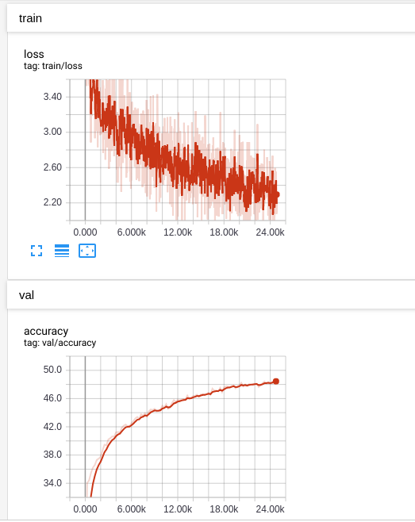
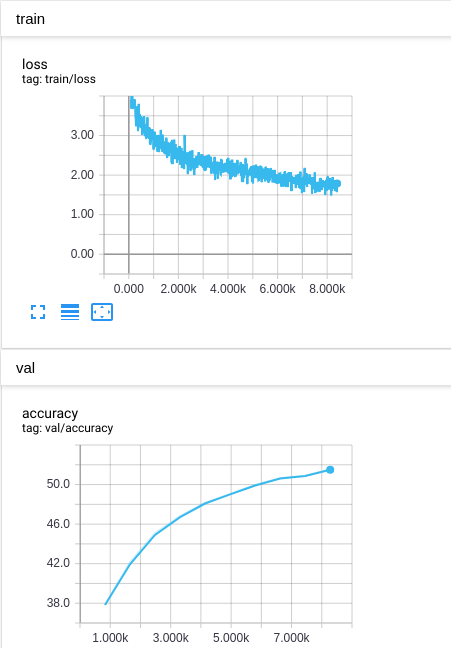
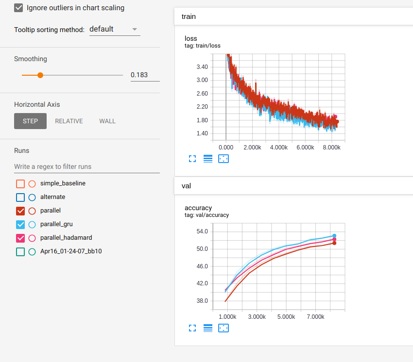

# Assignment 3: Visual Question Answering with PyTorch!

- Anuj Pahuja (apahuja)

## Task 1: Data Loader (30 points)

**Q1** Give a summary of your dataset implementation. What should be in the \_\_getitem\_\_ dictionary? 
How should that information be encoded as Tensors? If you consider multiple options, explain your thought process in picking. What preprocessing should be done? 

**Answer**:
1. Pre-computed the GoogleNet and ResNet18 features for all the images and saved them as `.npy` files. Code is in `compute_googlenet_feat.py` and `compute_resnet_feat.py`.
2. Pre-computed a vocabulary for both questions and answers from the training set and saved them as a `.json` file. Questions were first tokenized into individual words and were kept in vocabulary only if their count is greater than a threshold (6). Answers were preprocessed to handle punctuation and special characters. The top k (2000) answers were kept in vocabulary. Code is in `compute_vocab.py`.
3. Both the directory containing image features and the vocabulary json filename are passed as parameters to the dataset initializer.
4. Questions are encoded in two ways. First, as a binary vector (tensor) of dimension `q_vocab_size` where `q_vocab_size` is the number of words in question vocabulary. The vector's value at an index is 1 if the word corresponding to that index is present in vocabulary. Second, as a `max_question_length` vector of integer indices which stores the vocabulary index of every word in the question. This encoding is used for task 3.
5. Answers are encoded as integer vectors of dimension `a_vocab_size` where `a_vocab_size` is the number of words in answer vocabulary. The vector's value at an index is `count` where `count` is the number of times it was chosen as an answer by a human. Answers could also be encoded as a one-hot vector where the correct answer is chosen as the majority answer among the candidates (which is already happening but during training). A reason for not doing this during data loading is that `count` is required for evaluating metrics during training/testing.
6. `__getitem__` returns a dictionary with 5 items - `image_enc`: n-dim image feature (depending on task), `ques_enc`:`max_question_length`-dim integer question encoding, `ques_enc_oh`:`q_vocab_size`-dim binary question encoding, `ans_enc`:`a_vocab_size`-dim integer question encoding and `ques_len`: number of words in a question. 

## Task 2: Simple Baseline (30 points)

**Q2** Describe your implementation in brief, focusing on any design decisions you made: e.g what loss and optimizer you used, any training parameters you picked,
how you computed the ground truth answer, etc. If you make changes from the original paper, describe here what you changed and why. 

**Answer**\
Number of epochs: 10\
Loss: Softmax Cross Entropy for 2000 classes\
Optimizer: SGD

Unlike the paper, I didn't do any weight/gradient clipping. I tried it initially but my loss wasn't going down. Original source code of the paper uses a threshold of 3 for an answer to be kept in the vocabulary, I didn't enforce any threshold and just used the top 2000 most frequent answers. Ground truth answer was chosen using a majority vote (argmax of answer occurences). Accuracy was computed as described in the original VQA paper for open-ended task.

Accuracy after 10 epochs: 48.54%

## Task 3: Co-Attention Network (30 points)

**Q3** As in the above sections, describe your implementation in brief, e.g loss, optimizer, any decisions you made just to speed up training, etc.
 If you make changes from the original paper, describe here what you changed and why. 

**Answer**:\
Number of epochs: 10\
Loss: Softmax Cross Entropy for 2000 classes\
Optimizer: Adam

Unlike the paper, I used Adam with LR 1e-4 instead of RMSprop as RMSprop wasn't really converging (or taking too long). I also used a single layer LSTM unlike the 2-layer LSTM used in official implementation. Dimension of all the embeddings (questions, images, hidden) is 512. Different from the previous task, the question is encoded using a learnable embedding lookup table. Question length is used to pack every question embedding before being passed to the LSTM. Both Alternate and Parallel Co-Attention have been implemented. Results shown are for Parallel Co-Attention. Ground truth answer was chosen using a majority vote (argmax of answer occurences). Accuracy was computed as described in the original VQA paper for open-ended task.

Accuracy after 10 epochs: 51.53%

## Task 4: Custom Network  (10 points + 10 bonus points)
Brainstorm some ideas for improvements to existing methods or novel ways to approach the problem. 

For 10 extra points, pick at least one method and try it out. It's okay if it doesn't beat the baselines, we're looking for 
creativity here; not all interesting ideas work out. 

**Answer**:
1. A simple modification to the implementation in Task 3 is changing the LSTM to a GRU. This reduces the number of parameters, albeit not by much, but faster convergence and better results for same hyperparameters. Code is in `coattention_net_gru.py`. Comparison between the loss/accuracy curves is shown below.

2. Another simple modification to the implementation in Task 3 is changing the way how visual and question features are fused. Replacing addition with Hadamard product at all heirarchies results in faster convergence and better results. Code is in `coattention_net_hadamard.py`. Comparison between the loss/accuracy curves is shown below.

3. The current classification loss is a hard penalty based on the majority answer. I tried formulating the problem as a multi-label classification problem with answer being a many-hot vector based on annotations and weights assigned to every answer based on the answer confidence from the annotation. The binary cross-entropy loss per class is then weighted accordingly. While the loss reduced, the accuracy didn't change at all. The network converged to a trivial solution most probably. The modified code is in 3 files - `vqa_dataset_bce.py`, `coattention_experiment_runner_bce.py`, and `experiment_runner_base_bce.py`.

